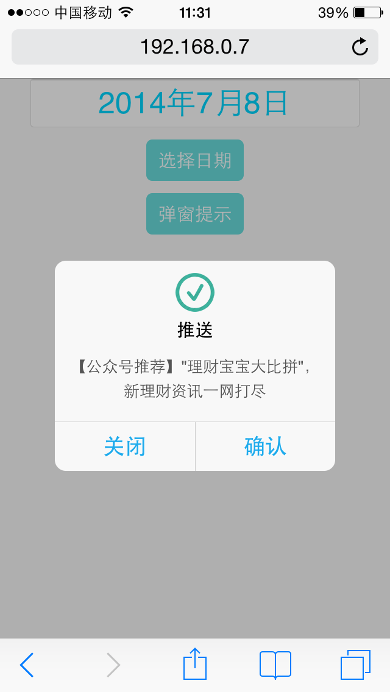

<h1>tipDialog</h1>

<h3>一个移动web上的弹窗提示插件</h3>

	<strong>说明：</strong>tipDialog.js 为require js所引用的，也可以使用sea.js  
	 					   tipDialog.rom.js为函数式调用

<pre>
	tipDialog({
                msg:'【公众号推荐】"理财宝宝大比拼"，新理财资讯一网打尽',  //内容
                type: 'success',                                     //状态
                title: '推送',
                btnOk: {                                             //确认按钮
                    val: '确认',                                     // 按钮文字
                    call: function(evt){                             // 确认按钮回调函数
                        console.log(evt)
                    },
                    close: false                                     // 触发后是否关闭弹窗（ true: 关闭， false: 保留）
                },
                btnCancel:{
                    val: '关闭',
                    call: function(evt){
                        console.log(evt)
                    },
                    close: true
                },
                autoClose: true,                                     // 是否自动关闭
                closeTime: 2000,                                     // 多长时间自动关闭
                ZorQ: 'jQuery'                                       // 基于 jQuery 还是 Zepto, 默认 'jQuery', 可选值：'jQuery' || 'Zepto'
            });
</pre>

	

